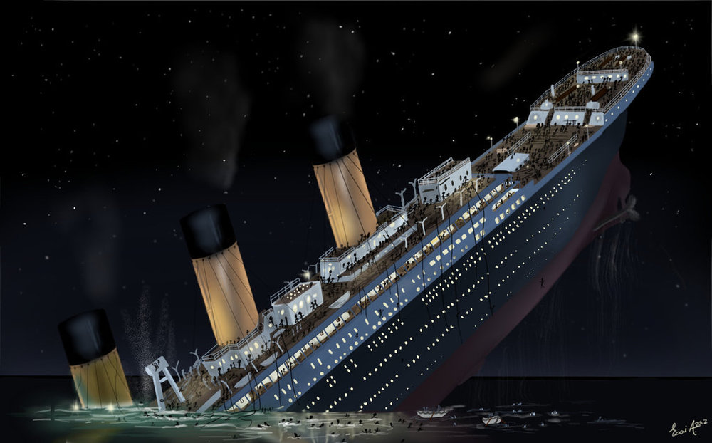
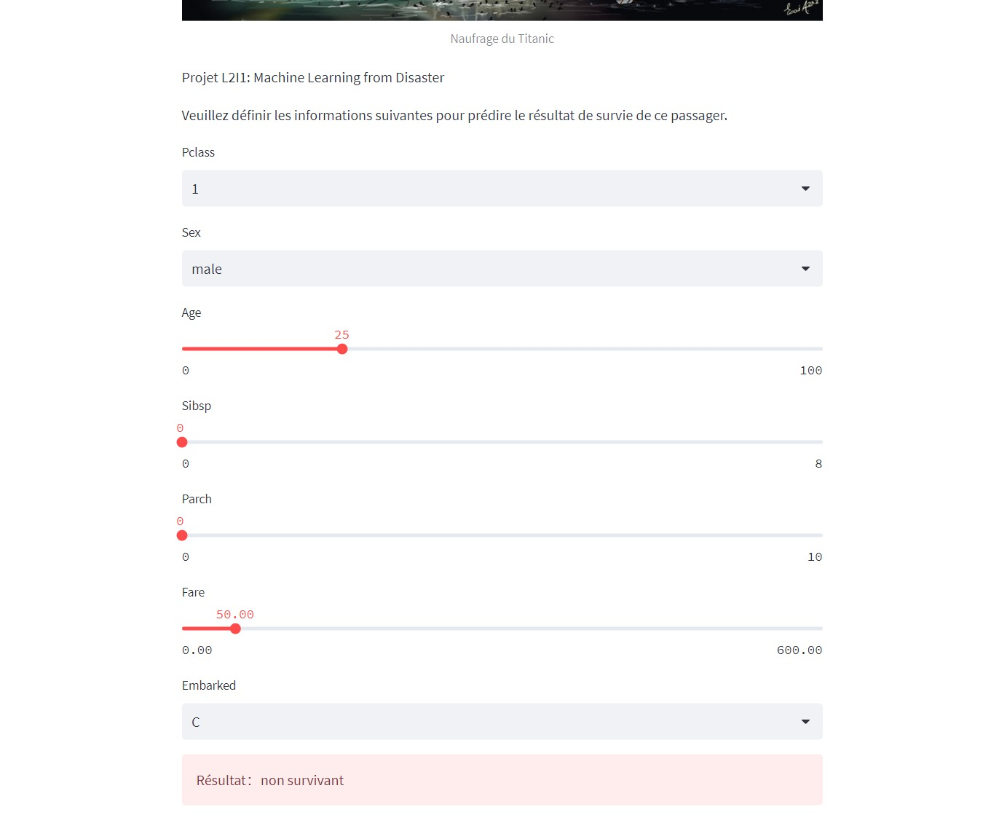

<h1 align="center">Sinking of the Titanic</h1>
<h2 align="center">A web application to predict the survival of a custom passenger on board the Titanic using the Random Forest model</h2>

  

<a href="https://steven-1105-streamlit-titanic-machine-lear-streamlit-app-9eum17.streamlit.app/">Try our demo</a>

## Introduction
The sinking of the Titanic is one of the most infamous shipwrecks in history. On April 15, 1912, during her maiden voyage, the widely considered “unsinkable” RMS Titanic sank after colliding with an iceberg. Unfortunately, there weren’t enough lifeboats for everyone onboard, resulting in the death of 1502 out of 2224 passengers and crew. While there was some element of luck involved in surviving, it seems some groups of people were more likely to survive than others. In this challenge, we have to build a predictive model that answers the question: “what sorts of people were more likely to survive?” using passenger data (ie name, age, gender, socio-economic class, etc).

## Objective
In this porjet, we will have access to two similar datasets that include passenger informations like name, age, gender, socio-economic class, etc. One dataset is titled 'train.csv' and the other one is titled 'test.csv'.
- train.csv will contain the details of a subset of the passengers on board (891 to be exact) and importantly, will reveal whether they survived or not, also known as the “ground truth”. This information will help us to establish a link between passenger informations and their survival.
- test.csv dataset contains similar information but does not disclose the “ground truth” for each passenger. We will have to find the best models to predict these outcomes with a maximum success rate.
We will use all the data available in the 'train.csv' file to predict whether the other 418 passengers on board (found in test.csv) survived.
### You may find more information about the Kaggle challenge here: https://www.kaggle.com/competitions/titanic/overview
